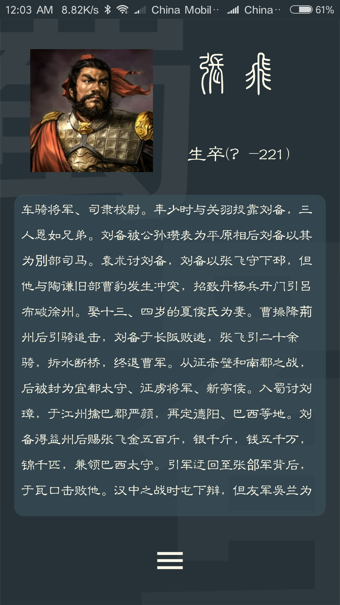
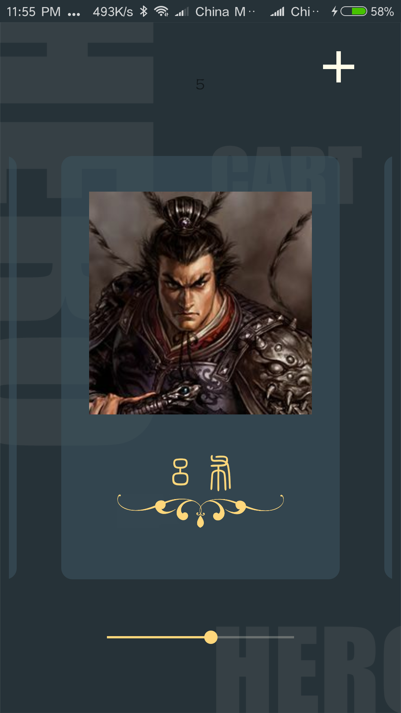
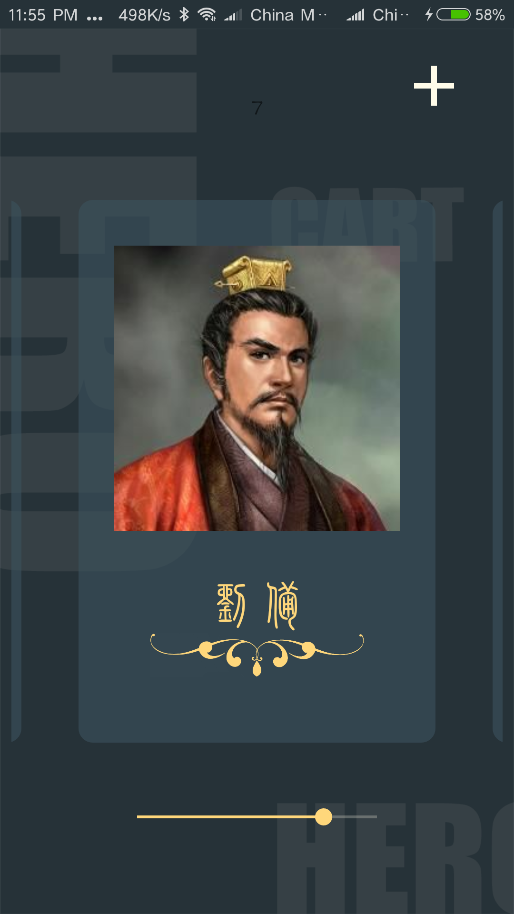
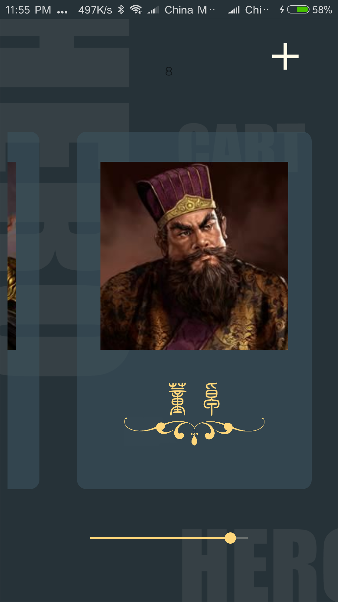
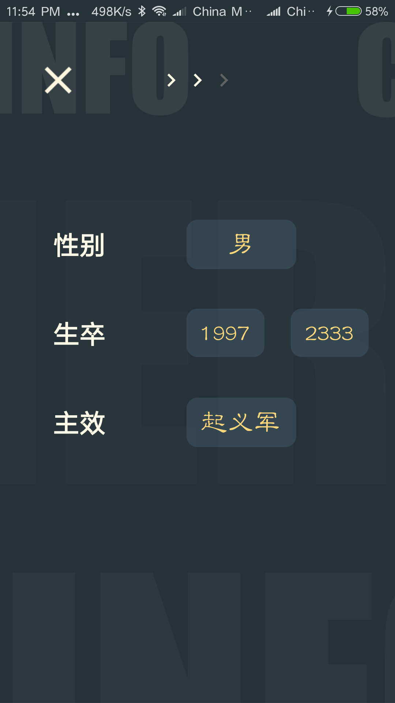

# 《三国演义词典》用户说明书

檀祖冰，任磊达

## 背景介绍

三国时期群英豪杰云聚，演绎着一段段传奇史诗。《三国演义词典》是一款极力还原史实，以人物为线索，记录历史上的悲欢离合，爱恨情仇。在这款应用中魔幻色彩的画风详实地记录了4500位历史群英，精致的卡片展示，细腻的人物刻画必能让你重返沙场，体验征战四方的乐趣。

## 功能展示

### 群英词典

打开应用，引入眼帘的是群英词典，可以通过搜索功能查询4500位英雄记录。搜索框智能的提示可以迅速搜索到所在的英雄，点开后可以查阅当前英雄的生卒年份以及历史详情。

另外，可以通过添加所效忠势力限定搜索范围，加快搜索效率和准确率。

| 搜索主界面       | 搜索栏        | 人物卡片        |
| ----------- | ---------- | ----------- |
|  |  |  |

### 人物画廊

在人物画廊当中，生动的展示了用户所收藏的多个人物，点进入可以打开人物卡片。

下方有滑动条，可以快速地滑动到对应任务位置，另外对于在画廊中的人物，可以使用词典界面搜索框，输入英雄姓名之后键入回车可以快速跳转到对应人物展板。

另外，长按人物卡片可以删除选定的人物。

| 吕布         | 刘备         | 董卓         |
| ---------- | ---------- | ---------- |
|  |  |  |

### 自定义记录

当然，有时候我们有自定义人物的需求记录的要求。《三国演义词典》提供了对应的功能记录想要记录的英雄。主要分为新建英雄以及更新画廊里现有的英雄：

1. 新建英雄

   - 点击右上角的“+”，可以进入人物编辑画面。
   - 完成三个部分对应的英雄信息，即可新建一个英雄。

2. 更新现有英雄

   - 在现有英雄界面，点击下方的“=”可以弹出提示框

     | 英雄界面       | 提示框        |
     | ---------- | ---------- |
     |  |  |

   - 选择编辑，会导入已有英雄信息，可以进行进一步完善。

     | 头像         | 信息         | 简介          |
     | ---------- | ---------- | ----------- |
     |  |  |  |

   - 点击右上角的确认，确认更新信息。

     

