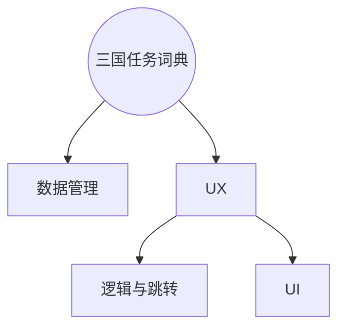

# 安卓期中Project实验报告

[TOC]

## 实验要求


## 实验目的

## 实验过程

### 模块规划

基于分析，此应用可分为以下模块



对于UX模块，可以概括规划几个JAVA模块，其中，各部分需要完成的工作如下

| MainActivity | EditActivity | ViewActivity | DetailActivity |
| :----------: | :----------: | :----------: | :------------: |
|  三国人物数据库搜索   |   编辑或者新增人物   |  浏览所有三国人物卡片  |     人物详情浏览     |


### UX模块实现

#### RecycleView与Fragment

使用RecycleView来定义人物卡片，定义卡片holder包含两个控件

* 用于显示名字的 TextView
* 用于显示头像的 ImageView

通过自定义RecycleView的适配器的借口，完成功能需求

* 轻触进入详情操作
* 长按可触发删除操作

比较关键的几个地方

* 设置RecycleView为水平排列

  ```java
  mRecycleView.setLayoutManager(new LinearLayoutManager(
                  this, LinearLayoutManager.HORIZONTAL, false));
  ```

* 设置位置

  ```java
  mRecycleView.smoothScrollToPosition(2); // 使用smooth 达到平滑效果
  ```

* 获取当前item的标号

  在事件中更新当前项标号，以供其他模块使用

  ```java
  mRecycleView.addOnScrollListener(new RecyclerView.OnScrollListener() {
    @Override
    public void onScrolled(RecyclerView recyclerView, int dx, int dy) {

      super.onScrolled(recyclerView, dx, dy);
      LinearLayoutManager layoutManager = 
        (LinearLayoutManager) mRecycleView.getLayoutManager();
      current_item_id = flayoutManager.findFirstVisibleItemPosition()+1;//更新
    }
  });
  ```

* 滑动时自动靠拢中部

  可以直接使用`LinearSnapHelper` 内置的一个函数来实现这一个需求，传入参数为有此需求的RecycleView

  ```java
  new LinearSnapHelper().attachToRecyclerView(mRecycleView);
  ```

   

而在编辑英雄界面，分为三屏分别进行“名字与头像”、“其他信息”、“人物简介”的编辑，由此选取了ViewPage与Fragment的组合实现，步骤如下

1. 在父Activity中添加ViewPager控件

   在布局中简单添加以下布局，建议使用match_parent以避免不必要的局部大小计算

   ```xml
   <android.support.v4.view.ViewPager
   android:id="@+id/vp_hero_edit"
   android:layout_width="match_parent"
   android:layout_height="match_parent"
   app:layout_constraintEnd_toEndOf="parent"
   app:layout_constraintTop_toTopOf="parent" />
   ```

   在Java中建立三个Fragment的View载体、适配器及其列表

   ```java
   private ViewPager mViewPager;
   private FragmentPagerAdapter mFragmentAdapter;
   private List<Fragment> mFragments = new ArrayList<Fragment>();
   ```

2. 分别自定义三个Fragment的界面及Java逻辑

   三个Fragment都有各自的布局，可以直接将Fragment视为Activity，直接放置需要的控件即可。由于第一个编辑界面需要调用系统的相机与图库等功能，需要定义接口。如下部分java代码在将View 实例化并return 之前，通过实例化的View获取到控件的id，并绑定了事件，事件执行内容为接口所定义。

   ```java
   public class editFragm_1 extends Fragment {
       OnClickGravter mCallback;
       //定义一个接口
       public interface OnClickGravter{
           //并实现一个方法，用来传值并在（onAttach()中绑定activity）
           public void onGravterClick();
       }
       protected View frameView = null;
       @Override
       public View onCreateView(LayoutInflater inflater, 
                                ViewGroup container, Bundle savedInstanceState)
       {
           if (frameView==null)
           {
               frameView = inflater.inflate(R.layout.activity_edit_fragm_1, 
                                            container, false);
               final ImageButton bnt_gravter = 
                     (ImageButton) frameView.findViewById(R.id.ed_gravater);
               bnt_gravter.setOnClickListener(new View.OnClickListener() {
                   @Override
                   public void onClick(View v) {
                       mCallback.onGravterClick();
                   }
               });
               // TODO
           }
           return frameView;
       }
       public void onAttach(Activity activity) {
           super.onAttach(activity);
           try {
               mCallback = (OnClickGravter) activity;
           } catch (ClassCastException e) {
               throw new ClassCastException(activity.toString()
                       + " must implement OnHeadlineSelectedListener");
           }
       }
   }
   ```

   所以对于一个attach到一个activity的Fragment需要完成以下的事情

   * 定义样式，与Activity一致
   * 定义接口以供外部的Activity设置事件
   * 在return View前获取相关元素进行事件绑定

   对于第三个Fragment存在一个人物内容简介输入框，要求有

   * 输入框可以进行滑动

     EditText或者TextView的可滑动都可由xml中定义`android:scrollbars="vertical"`实现，但TextView还需要在Java中设置`.setMovementMethod(ScrollingMovementMethod.getInstance())`

   * 输入框在未进行输入时，占屏幕合适大小位置，软键盘升起时进行高度减少。点击屏幕其他地方结束输入

     现需要获取Fragment底层的Layout，并绑定事件“将为底层Layout设置焦点，取消EditText的焦点”

     ```java
     final ConstraintLayout root = (ConstraintLayout) editText.getRootView();
     root.setOnClickListener(new View.OnClickListener() {
       @Override
       public void onClick(View v) {
         root.setFocusable(true);
         root.setFocusableInTouchMode(true);
         root.requestFocus();
         editText.clearFocus();
       }
     });
     ```

     ​

     ```java
     editText.setOnFocusChangeListener(new View.OnFocusChangeListener() {
       private static final int moveDis = tool_for_project.dip2px(getContext(),180);
       private static final int timeIntervel = 500;
       @Override
       public void onFocusChange(View v, boolean hasFocus) {
         ValueAnimator f = null;
         if (hasFocus)
         {
           f = ValueAnimator.ofInt(
             tool_for_project.dip2px(getContext(),400),
             tool_for_project.dip2px(getContext(),200));
         }
         else
         {
           f = ValueAnimator.ofInt(
             tool_for_project.dip2px(getContext(),200),
             tool_for_project.dip2px(getContext(),400));
           InputMethodManager imm = (InputMethodManager)
             getActivity().getSystemService(Context.INPUT_METHOD_SERVICE);
           assert imm != null;
           imm.hideSoftInputFromWindow(root.getWindowToken(), 0);
         }

         f.addUpdateListener(new ValueAnimator.AnimatorUpdateListener() {

           // 启动动画之后, 会不断回调此方法来获取最新的值
           @Override
           public void onAnimationUpdate(ValueAnimator animator) {
             // 获取最新的高度值
             ViewGroup.LayoutParams para = editText.getLayoutParams();
             para.height = (Integer) animator.getAnimatedValue();
             editText.setLayoutParams(para);
           }
         });

         f.setDuration(timeIntervel);
         f.start();


       }
     });
     ```

     ​

   ​

   ​


#### 动画与手势


#### 权限管理

### 数据模块实现


## 问题总结

* 父Activity中获取Fragment中的控件
* onFling OnClick 冲突


