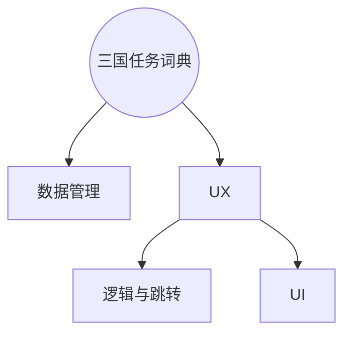

# 安卓期中Project实验报告

[TOC]

## 实验要求

## 实验目的

## 实验过程

### 模块规划

基于分析，此应用可分为以下模块

对于UX模块，可以概括规划几个JAVA模块，其中，各部分需要完成的工作如下

| MainActivity | EditActivity | ViewActivity | DetailActivity |
| :----------: | :----------: | :----------: | :------------: |
|  三国人物数据库搜索   |   编辑或者新增人物   |  浏览所有三国人物卡片  |     人物详情浏览     |

### UX模块实现

#### Fragment与RecycleView
#### 动画与手势

* onFling OnClick 冲突
#### 权限管理

### 数据模块实现

