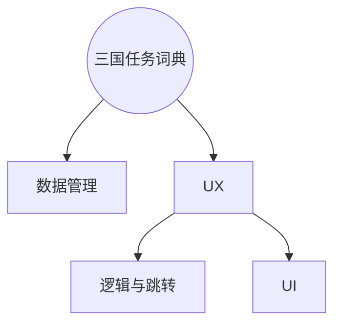

# 安卓期中Project实验报告

[TOC]

## 实验要求


## 实验目的

## 实验过程

### UX规划

基于分析，此应用可分为以下界面模块



对于UX模块，可以概括规划几个JAVA模块，其中，各部分需要完成的工作如下

| MainActivity | EditActivity | ViewActivity | DetailActivity |
| :----------: | :----------: | :----------: | :------------: |
|  三国人物数据库搜索   |   编辑或者新增人物   |  浏览所有三国人物卡片  |     人物详情浏览     |

### 界面实现

#### RecycleView与Fragment

使用RecycleView来定义人物卡片，定义卡片holder包含两个控件

* 用于显示名字的 TextView
* 用于显示头像的 ImageView

通过自定义RecycleView的适配器的借口，完成功能需求

* 轻触进入详情操作
* 长按可触发删除操作

比较关键的几个地方

* 设置RecycleView为水平排列

  ```java
  mRecycleView.setLayoutManager(new LinearLayoutManager(
                  this, LinearLayoutManager.HORIZONTAL, false));
  ```

* 设置位置

  ```java
  mRecycleView.smoothScrollToPosition(2); // 使用smooth 达到平滑效果
  ```

* 获取当前item的标号

  在事件中更新当前项标号，以供其他模块使用

  ```java
  mRecycleView.addOnScrollListener(new RecyclerView.OnScrollListener() {
    @Override
    public void onScrolled(RecyclerView recyclerView, int dx, int dy) {

      super.onScrolled(recyclerView, dx, dy);
      LinearLayoutManager layoutManager = 
        (LinearLayoutManager) mRecycleView.getLayoutManager();
      current_item_id = flayoutManager.findFirstVisibleItemPosition()+1;//更新
    }
  });
  ```

* 滑动时自动靠拢中部

  可以直接使用`LinearSnapHelper` 内置的一个函数来实现这一个需求，传入参数为有此需求的RecycleView

  ```java
  new LinearSnapHelper().attachToRecyclerView(mRecycleView);
  ```


而在编辑英雄界面，分为三屏分别进行“名字与头像”、“其他信息”、“人物简介”的编辑，由此选取了ViewPage与Fragment的组合实现，步骤如下

1. **在父Activity中添加ViewPager控件**

   在布局中简单添加以下布局，建议使用match_parent以避免不必要的局部大小计算

   ```xml
   <android.support.v4.view.ViewPager
   android:id="@+id/vp_hero_edit"
   android:layout_width="match_parent"
   android:layout_height="match_parent"
   app:layout_constraintEnd_toEndOf="parent"
   app:layout_constraintTop_toTopOf="parent" />
   ```

   在Java中建立三个Fragment的View载体、适配器及其列表，并添加三个Fragment到列表中

   ```java
   private ViewPager mViewPager;
   private FragmentPagerAdapter mFragmentAdapter;
   private List<Fragment> mFragments = new ArrayList<Fragment>();
   mFragments.add(new editFragm_1());
   mFragments.add(new editFragm_2());
   mFragments.add(new editFragm_3());
   ```

   给Fragment的适配器重写必要方法

   ```java
   mFragmentAdapter = new FragmentPagerAdapter(getSupportFragmentManager()){
     @Override
     public int getCount(){ return mFragments.size(); }
     @Override
     public Fragment getItem(int arg0){ return mFragments.get(arg0); }
   };
   mViewPager.setAdapter(mFragmentAdapter);
   ```

   给ViewPager进行必要设置及绑定必要事件

   ```java
   mViewPager.setOffscreenPageLimit(3);  // 增加最大页面缓存，使得Fragment不被销毁
   mViewPager.setOnPageChangeListener(new ViewPager.OnPageChangeListener()
   {
       @Override
       public void onPageSelected(int position)
       {
           ViewGroup.LayoutParams para = prog_top.getLayoutParams();
           para.width = tool_for_project
                        .dip2px(heroEditActivity.this,24.0f)*(position+1);
           prog_top.setLayoutParams(para);
           img_bnt_comfirm.setVisibility( position == 2? 
                                          View.VISIBLE:View.INVISIBLE);
           tool_for_project.SoftKeyBoardOpenOrHodden(getBaseContext(),
                                                     prog_top.getRootView(),
                                                     false);
       }
       @Override
       public void onPageScrolled(int arg0, float arg1, int arg2){ }
       @Override
       public void onPageScrollStateChanged(int arg0) {  }
   });
   ```

2. **分别自定义三个Fragment的界面及Java逻辑**

   三个Fragment都有各自的布局，可以直接将Fragment视为Activity，直接放置需要的控件即可。由于第一个编辑界面需要调用系统的相机与图库等功能，需要定义接口。如下部分java代码在将View 实例化并return 之前，通过实例化的View获取到控件的id，并绑定了事件，事件执行内容为接口所定义。

   ```java
   public class editFragm_1 extends Fragment {
       OnClickGravter mCallback;
       public interface OnClickGravter{
           public void onGravterClick();
       }
       protected View frameView = null;
       @Override
       public View onCreateView(LayoutInflater inflater, 
                                ViewGroup container, 
                                Bundle savedInstanceState){
           if (frameView==null) {
               frameView = inflater.inflate(R.layout.activity_edit_fragm_1, 
                                            container, false);
               final ImageButton bnt_gravter = 
                     (ImageButton) frameView.findViewById(R.id.ed_gravater);
               bnt_gravter.setOnClickListener(new View.OnClickListener() {
                   @Override
                   public void onClick(View v) {
                       mCallback.onGravterClick();
                   }
               });
               // TODO
           }
           return frameView;
       }
       public void onAttach(Activity activity) {
           super.onAttach(activity);
           try {
               mCallback = (OnClickGravter) activity;
           } catch (ClassCastException e) {
               throw new ClassCastException(activity.toString()
                       + " must implement OnHeadlineSelectedListener");
           }
       }
   }
   ```

   所以对于一个attach到一个activity的Fragment需要完成以下的事情

   * 定义样式，与Activity一致
   * 定义接口以供外部的Activity设置事件
   * 在return View前获取相关元素进行事件绑定

   对于第三个Fragment存在一个人物内容简介输入框，要求有

   * 输入框可以进行滑动

     EditText或者TextView的可滑动都可由xml中定义`android:scrollbars="vertical"`实现，但TextView还需要在Java中设置`.setMovementMethod(ScrollingMovementMethod.getInstance())`

   * 输入框在未进行输入时，占屏幕合适大小位置，软键盘升起时进行高度减少。点击屏幕其他地方结束输入

     现需要获取Fragment底层的Layout，并绑定事件“将为底层Layout设置焦点，取消EditText的焦点”

     ```java
     final ConstraintLayout root = (ConstraintLayout) editText.getRootView();
     root.setOnClickListener(new View.OnClickListener() {
       @Override
       public void onClick(View v) {
         root.setFocusable(true);
         root.setFocusableInTouchMode(true);
         root.requestFocus();
         editText.clearFocus();
       }
     });
     ```

     接着获取通过这一个实例化的View获取到editText

     ```java
     editText.setOnFocusChangeListener(new View.OnFocusChangeListener() {
       private final int after_height = tool_for_project.dip2px(getContext(),190);
       private final int origin_height = tool_for_project.dip2px(getContext(),420);
       private final int timeIntervel = 400;
       @Override
       public void onFocusChange(View v, boolean hasFocus) {
         ValueAnimator f = null;
         if (hasFocus) { // 触发输入
           f = ValueAnimator.ofInt(v.getHeight(),after_height);
         }
         else {          // 失去焦点
           f = ValueAnimator.ofInt(v.getHeight(),origin_height);
           tool_for_project.SoftKeyBoardOpenOrHodden(getContext(),root,false);
         }
         // f.addUpdateListener(...);
         f.setDuration(timeIntervel);
         f.start();
       }
     });
     ```

#### 动画与手势

在应用中大量使用动画和手势，动画用于高度的变化、位置的移动等，对于

* **高度**

  使用ValueAnimator，如在输入栏变窄的事件中，这样改变一个控件的高度

  ```java
  f = ValueAnimator.ofInt(v.getHeight(),after_height); 
  f.addUpdateListener(new ValueAnimator.AnimatorUpdateListener() {
      @Override // 启动动画之后, 会不断回调此方法来获取最新的值
      public void onAnimationUpdate(ValueAnimator animator) {
          ViewGroup.LayoutParams para = editText.getLayoutParams();
          para.height = (Integer) animator.getAnimatedValue();
          editText.setLayoutParams(para); // 设置高度
      }
  });
  f.setDuration(timeIntervel).start();
  ```

* **位置**

  使用ObjectAnimator， 如搜索栏上移等操作，与ValueAnimator不同之处在于，ObjectAnimator可以直接指定物体及其相应属性，不需要另外设置事件。但是，ObjectAnimator并不支持高度调整属性。

  ```java
  ObjectAnimator translationUp1 = ObjectAnimator.ofFloat(mSearchView, "Y",
                                      mSearchView.getY(),marginToTop);
  translationUp1.setDuration(timeIntervel);
  translationUp1.setInterpolator(new DecelerateInterpolator());
  translationUp1.start();
  ```


### 数据模块实现

#### 文件处理

主要涉及图片的管理，在项目中新建了两个函数用于在特定文件夹内保存和访问的操作，但首先，图片需要进行大小裁剪处理

```java
bm = ThumbnailUtils.extractThumbnail(bm,px , px);
```

通常我们使用bitmap进行图片设置，所以统一使用bitmap用于程序中的图片文件传输

```java
public static boolean saveBitmapToLocal(Context context,Bitmap bitmap,String filename)
        throws IOException {
    String rootPath = Environment.getExternalStorageDirectory()
            .getAbsolutePath() +context.getString(R.string.storage_folder)+"/";
    new File(rootPath).mkdirs(); // 如果没有创建文件夹呼吁创建
    FileOutputStream b =null;
    try {
        b = new FileOutputStream(rootPath+filename);
        assert bitmap != null;
        bitmap.compress(Bitmap.CompressFormat.JPEG,100,b);
    } catch (FileNotFoundException e) {
        e.printStackTrace();
        return false;
    }finally {
        b.flush();
        b.close();
    }
    return true;
}
```

读取图片

```java
public static Bitmap readBitmapFromLocal(Context context, String filename)
        throws FileNotFoundException {
    String rootPath = Environment.getExternalStorageDirectory()
            .getAbsolutePath()  +context.getString(R.string.storage_folder)+"/";
    File file = new File(rootPath);
    if (file.exists()){
        FileInputStream f = new FileInputStream(rootPath+filename);
        return BitmapFactory.decodeStream(f);
    }
    return null;
}
```

### 功能性

#### 图库与拍照

在申请得到权限后，在需要跳转到此业务逻辑的地方

* 拍照

```java
Intent intent = new Intent(Intent.ACTION_PICK, null);
intent.setDataAndType(MediaStore.Images.Media.EXTERNAL_CONTENT_URI, IMAGE_UNSPECIFIED);
startActivityForResult(intent, GALLERY_CODE);
```

* ​

### 其他

* px与dip的转换

  在进行排版的时候，需要用到dp作为单位，但是在程序中需要使用px作为单位，所以需要函数用于单位转换

  ```java
  public static int px2dip(Context context, float pxValue) {
      final float scale = context.getResources().getDisplayMetrics().density;
      return (int) (pxValue / scale + 0.5f);
  }
  public static int dip2px(Context context, float dpValue) {
      final float scale = context.getResources().getDisplayMetrics().density;
      return (int) (dpValue * scale + 0.5f);
  }
  ```

* 权限管理

  应用需要使用访问图库、拍照、文件, 在`AndroidManifest.xml`中添加必要权限

  ```xml
  <uses-permission android:name="android.permission.CAMERA" />
  <uses-feature android:name="android.hardware.camera" />
  <uses-feature android:name="android.hardware.camera.autofocus" />
  <uses-permission android:name="android.permission.WRITE_EXTERNAL_STORAGE" />
  ```

  在自定义类中为所需要的权限添加需要的权限标号及对应的API接口（在Activity）中调用

  ```java
  static public  class Permission {
      private static final int REQUEST_EXTERNAL_STORAGE = 1;
      private static String[] PERMISSIONS_STORAGE = {
              Manifest.permission.READ_EXTERNAL_STORAGE ,
              Manifest.permission.WRITE_EXTERNAL_STORAGE
      };
      private static String[] PERMISSIONS_CAMERA = {
              Manifest.permission.CAMERA,
      };
      public static void verifyStoragePermissions(Activity activity) {
          int permission = ActivityCompat.checkSelfPermission(activity,
                  Manifest.permission.READ_EXTERNAL_STORAGE);
          if (permission != PackageManager.PERMISSION_GRANTED) {
              ActivityCompat.requestPermissions(activity,
                      PERMISSIONS_STORAGE, REQUEST_EXTERNAL_STORAGE);
          }
      }
      public static void verifyCameraPermissions(Activity activity) {
          int permission = ActivityCompat.checkSelfPermission(activity,
                  Manifest.permission.CAMERA);
          if (permission != PackageManager.PERMISSION_GRANTED) {
              ActivityCompat.requestPermissions(activity,
                      PERMISSIONS_CAMERA, REQUEST_EXTERNAL_STORAGE);
          }
      }
  }
  ```

  ​


## 问题总结

* 父Activity中获取Fragment中的控件
* onFling OnClick 冲突


